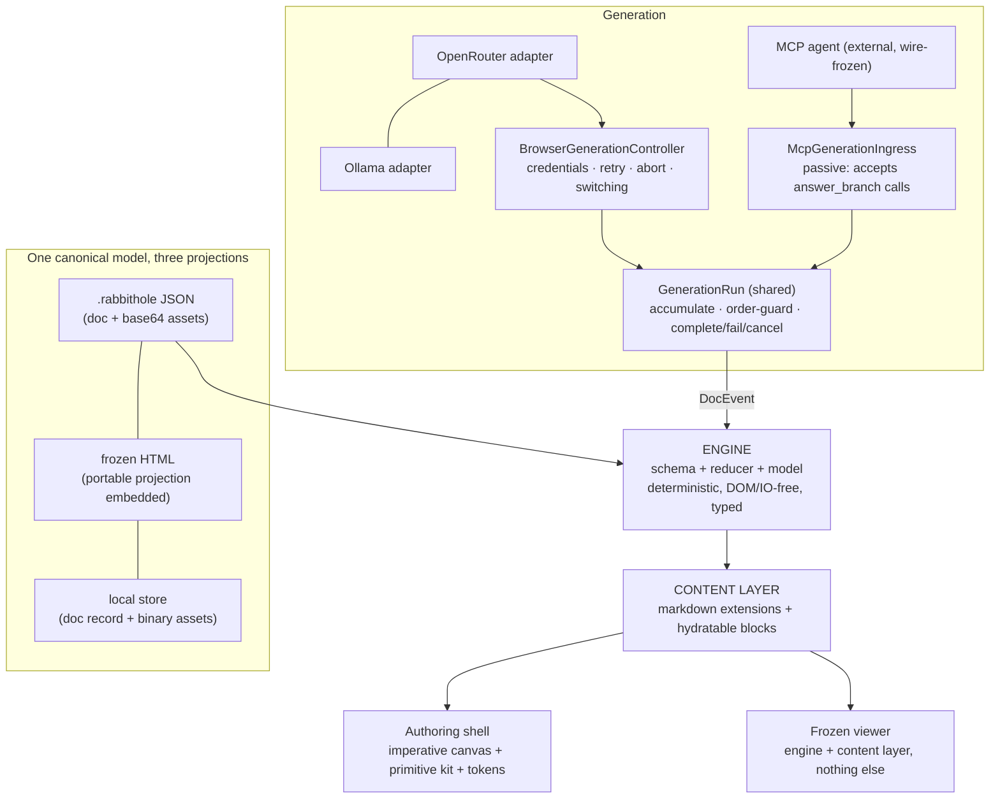

# THESEUS — replacing the engine mid-flight

**The plan for rebuilding Rabbithole into its from-scratch ideal, shipped as a sequence of invisible engine swaps.**
**Version 2.2 — approved for execution.** v2 corrected the five P0 findings from adversarial review (baseline governance, TypeScript packaging, orchestrator boundary, title protocol, forward-compatible learner state); v2.1 applies the four final pre-flight amendments (normative bridge release, store wording, settings deletion target, test-case-level classification); v2.2 adds the evergreen-hygiene amendment (Rule 10, D9, the Phase 9 remnant audit) — this is a public, evergreen open-source codebase, and migration scaffolding must not outlive its phase. Amendments to this document go through Part VII's decisions table.

This document designs the system we would build if we were starting from zero — unburdened by the existing code, bound absolutely by the existing product — and then sequences the rebuild so that a user on rabbithole.ing, a reader of a frozen snapshot, and an agent mid-session over MCP never notice that the plane they're flying in has been rebuilt around them.

**Baseline policy:** code citations below are pinned to and verified against baseline commit `419cc09`. That commit is the governing reference for Phase 0 and for every cited implementation detail in this plan. The baseline is healthy: the full 12-stage `npm test` suite passes on `419cc09`.

---

## Part I — Philosophy

Ten rules govern every phase. When a phase decision is ambiguous, these break the tie, in order.

1. **Every commit flies.** `main` is always shippable and deployed. There is no rewrite branch, no integration hell, no "big merge." Every phase is a strangler move: build the new organ beside the old, wire it in behind identical behavior, prove parity, delete the old organ. If a phase can't land in shippable slices, the phase is designed wrong.
2. **The data is the program.** Code is disposable; formats are forever. A `.rabbithole` file or frozen snapshot minted today must open in the final system and in every intermediate system. The persisted schema is the most important interface in the product; it changes last, most carefully, only with migrations proven against a fixture corpus — and *device-local preferences and credentials are user data too* (see the compatibility matrix).
3. **Gauges before surgery.** No engine gets swapped without instruments proving the flight envelope is unchanged. But instruments are *classified* (Part III): a test that asserts a known defect is not a golden truth, it's a defect with a tripwire. "It looks the same to me" is not evidence — and neither is a fossilized wrong assertion.
4. **One representation; derive the rest.** Every piece of information has exactly one canonical *model*; projections derive from it. Duplication of representation is where our bugs live (ad-hoc snapshot hydration, in-band title sentinel, per-screen CSS values). One canonical model does **not** mean one physical encoding everywhere — see the artifact contract.
5. **Interfaces small enough to hold in your head.** The finished system has six contracts, listed in Part II. Each fits on one screen. If a contract grows past that — or needs per-host conditionals to survive — it's two contracts wearing a trenchcoat, and it gets split.
6. **Deleted code is debugged code.** Every phase names its deletions up front and is not complete until they're gone or explicitly deferred through the decisions table. The deletion ledger in Part V is a first-class exit criterion.
7. **Do the riskiest part of each phase first.** Prove the scary bit with a spike before building the comfortable scaffolding around it. Where this plan asserts an architectural unification (shared orchestration, unified content types), the unification is a *hypothesis the spike tests*, never a mandate the code must obey.
8. **When in doubt, measure.** Disagreements about regressions are settled by the parity harness and the budgets — with tolerances, not zealotry. Budgets ratchet: the measured current value becomes the ceiling, and worsening it requires an explicit, recorded trade-off.
9. **Invisible engine, visible craft.** Engine and data swaps must be imperceptible. Interface improvements must NOT be — they are deliberate, designed against the experience standard (Part III), reviewed in a real browser, and allowed to be seen. A flawless refactor that perfectly preserves an awkward settings panel has failed half its mission.
10. **Evergreen, not excavated.** This is a public open-source codebase, not a migration diary — a reader cloning the repo after Phase 9 should find no archaeology. Phase-transitional scaffolding (parallel old organs past their parity window, migration shims, temporary flags, phase-labeled comments) is debt the moment its phase exits, and each phase removes its own. Test instruments live in `test/`; shipped source may expose at most **one small, documented test seam**, each entry justified by a flow that genuinely cannot be driven through the product's real surface — undocumented ad-hoc `*ForTest` hooks are forbidden from here on (existing ones are D9). C4 known-defect tripwires retire in the phase that fixes their defect; the scenario manifest carries no stale rows past a phase exit.

---

## Part II — The target system

What we would build from scratch. This is the destination; Part IV is the flight plan.

### Layer map



### The six contracts

**1. `DocEvent` — the engine's vocabulary.** Already exists and is already correct in shape (`src/core/reducer.js:31-52`); it gains types and two corrections, not new semantics.

```ts
type DocEvent =
  | { type: "branch_request"; parent_id: string; node_id: string; origin: Origin; request_id?: string }
  | { type: "node_progress"; node_id: string; markdown: string; run?: { id: string; seq: number } }
  | { type: "node_answered"; node_id: string; title: string; markdown: string; /* position, size, base_url… */ }
  | { type: "node_update"; node_id: string; /* partial fields */ }
  | { type: "nodes_update"; nodes: Array<{ node_id: string /* … */ }> }
  | { type: "delete_node"; node_id: string }
  | { type: "view_state"; state: ViewState }
```

Two honest corrections to v1's claims:
- **The reducer is deterministic and DOM/IO-free, not referentially pure.** It clones the node *Map* but mutates node objects from the previous state (`reducer.js:78`, `Object.assign(node, …)`). The typing phase decides once: make it immutable with frozen-input tests, or document shared-node mutation as a contract. No silent middle ground.
- **Full-text `node_progress` is idempotent but not order-tolerant.** A stale shorter update arriving late regresses the document. The `GenerationRun` stamps `{id, seq}`; the run (or reducer guard) drops non-monotonic progress for the same run. Replace-semantics stay — they are why the event stream must never become the storage format (quadratic growth).

**2. Generation — adapters, controllers, and one shared run.** Brains generate; they never know node IDs, document shapes, or persistence. But the two hosts are *not* the same machine wearing different hats, and the architecture must say so:

- The **browser host is active**: it initiates streams, owns AbortControllers, handles provider auth (401 → key prompt → retry closure), and deliberately persists partial markdown for durable asks (`src/web/transport/direct-host.js:371-388`).
- The **MCP host is passive**: an external agent calls `answer_branch`; the server never initiates generation, has no credentials, and deliberately *drops* half-streamed markdown when persisting pending nodes — on resume, the question is re-asked fresh (`src/node/transport/session.js:452-462`, by design and documented in-code).

These divergences are product decisions, not accidents. So the shared unit is the smallest honest one:

```ts
interface GenerationRun {                       // shared: accumulation + transition building
  accept(event: GenerationEvent): void          // text deltas accumulate; order-guarded by seq
  complete(): NodeAnsweredTransition            // builds the node_answered payload
  fail(error: NormalizedError): NodeErrorTransition
  cancel(): void
}

type GenerationEvent =
  | { type: "text"; delta: string }
  | { type: "title"; title: string }
  | { type: "usage"; input_tokens: number; output_tokens: number }

interface ProviderAdapter {
  id: string; label: string
  credential: "api-key" | "none"
  listModels(config: ProviderConfig): Promise<Model[]>
  validate(config: ProviderConfig): Promise<ValidationResult>
  createBrain(config: ProviderConfig): Brain
}

interface Brain {                               // browser-side; note ALL THREE surfaces
  answerBranch(ctx: BranchContext, signal: AbortSignal): AsyncIterable<GenerationEvent>
  authorExplainer(ctx: ExplainerContext, signal: AbortSignal): AsyncIterable<GenerationEvent>
  authorDocument(source: IngestSource, signal: AbortSignal): AsyncIterable<GenerationEvent>   // exists today: src/web/brain/openai-compatible.js:14
}
```

`BrowserGenerationController` owns providers, credentials, retry, abort, and mid-stream switching. `McpGenerationIngress` accepts external partial/final tool calls behind the frozen wire protocol. Each host keeps its own persistence policy (including the pending-markdown divergence). Both feed `GenerationRun`; the run feeds the reducer. **"One orchestrator" is a hypothesis**: if, after both controllers exist, a spike shows they share more than the run, merge then — never before.

**The title protocol, honestly.** Introducing `{type: "title"}` does not conjure titles: OpenRouter/Ollama return unstructured deltas, so the title still originates from the `TITLE:` sentinel the prompts request. The migration is containment, then replacement:
1. `TitleSentinelParser` moves *inside* the provider adapter; the adapter emits `{type:"title"}`; the host loses all sentinel knowledge (deleting it from `direct-host.js:319-338`).
2. The prompt protocol is initially preserved verbatim — zero behavior change.
3. A separate spike evaluates replacements (structured outputs, deterministic derivation from the markdown, cheap second call) against three gates: latency, cost, title quality on the eval set.
4. The sentinel itself dies only if a replacement clears all three gates. The MCP path is untouched — its titles already arrive out-of-band in the `answer_branch` call.

**3. The content layer — two kinds of content, not one.** v1's single `ContentType` over-unified unlike things. Code and math are static markdown output; `show`/`walk`/`check`/`play` are hydratable blocks with lifecycle; inline math isn't even a fence. Two contracts:

```ts
interface MarkdownExtension {                    // code, inline+block math — static, synchronous
  id: string
  render(source: string, ctx: RenderCtx): string // trusted renderers build safe output directly
}

interface HydratableBlock<M, S = void> {         // show, walk, check, play
  type: string; version: number
  parse(source: string): M
  renderLive(model: M, ctx: LiveCtx): Mount      // Mount = { element, dispose?() }
  renderFrozen(model: M, ctx: FrozenCtx): string
  toPlainText(model: M): string                  // search, a11y, synthesize
  security: "sanitize-html" | "safe-dom"         // explicit per type, not blanket
  // stateful types only:
  initialState?(model: M): S
  migrateState?(old: unknown, fromVersion: number): S
}
```

Security is per-type policy, not a blanket pipe: types rendering untrusted HTML source (`show`) pass the DOMPurify profile (`src/ui/visuals.js:8-16`) on both paths; trusted renderers (KaTeX — whose MathML a blanket sanitize could damage) construct DOM through safe APIs and are audited as such. URL/asset policy stays central. Streaming-pending placeholders (`src/core/markdown-renderer.js:266-285`) become contract behavior. Registration is the allowlist — the hardcoded `VISUAL_FENCE_LANGUAGES` set dies. **"Learning primitives are hydratable blocks" is provisional** until the first real primitive validates the contract (Phase 8); the contract is finalized *after* that evidence, not before.

**4. The artifact — one logical model, three projections.** The canonical thing is the schema-validated document model (`src/core/schema.js` remains the sole runtime authority — types describe it, never replace it; imported files, MCP inputs, and provider responses stay untrusted regardless of internal types). Its projections:

```text
Canonical document model
    ├── portable projection  (.rabbithole: document + base64 assets — portable.js:18-23)
    ├── local-store projection (document record + BINARY asset records — never base64 in IndexedDB)
    └── snapshot projection  (portable projection embedded inert in frozen HTML; hydration DERIVED at load)
```

The shipped frozen snapshot embeds exactly one portable projection as inert data and derives hydration at load, so every new snapshot is a re-importable interchange file. Import accepts `.rabbithole` and snapshot `.html`; the payload is extracted as text, parsed under uniform caps, and never executed or inserted.

**5. The primitive kit — ten components, delivered vertically.** Button, IconButton, Field, Select, Combobox, Popover, Dialog, Tooltip, Menu, Notice — vanilla, token-styled, one anchoring engine, one focus contract:

```ts
interface Primitive<P> { mount(props: P): Handle }
interface Handle {
  element: HTMLElement
  update(props: Partial<P>): void   // in-place; never rebuild-and-replace
  dispose(): void                   // removes listeners, restores focus if it held it
}
```

"Owned" means owned API, behavior, and styling — not a vow to hand-write every collision and accessibility algorithm; adapt proven positioning/a11y logic where it's better than ours. Crucially, the kit is **not built as a horizontal framework project**: primitives are extracted when a real surface needs them (Part IV, Phases 3-4), starting with the settings vertical slice. `update()` exists so state changes patch DOM in place — the "rebuild settings with innerHTML and hunt for focus with a selector" bug class becomes structurally impossible.

**6. The store.** The real port is eleven operations, not six: `listHoles, loadHole, saveHole, deleteHole, listAssets, getAsset, putAsset, deleteAsset, createStaging, putStagedAsset, adoptStagedAssets` (`src/core/store.js:18-30` — the staging trio serves PDF ingestion). It stays, gains types, and remains the only **document and asset** persistence port — preferences and credentials deliberately live in their own isolated stores (see the state taxonomy).

### State taxonomy — one owner per value

| Kind | Examples | Owner | Persisted? | Exported? |
|---|---|---|---|---|
| Document | nodes, view_state, authored block content | engine state | yes (canonical model) | yes |
| Learner progress | check attempts/answers | versioned extension bag (Phase 8) | yes (device) | excluded from frozen **shares** by default; portable-**backup** policy is a separate open decision (Part VII) |
| Session | active hole, in-flight runs, abort controllers | host controller | no (except each host's deliberate durable-ask policy) | no |
| UI ephemera | open popover, focused field | owning primitive | no | no |
| Preferences | provider id, model per provider, theme, last hole, sidebar | device prefs store (`rh-web-settings` et al.) | yes (device only) | **never** |
| Credentials | API keys (`rh-web-api-key`, `rh-web-api-keys`) | isolated credential store | yes (device only) | **never** — unreachable from export code paths by construction |

### Deliberate constraints

- **No framework runtime.** Revisit trigger: chrome surface ≳ 2× the kit, or collaborative presence.
- **No event-sourced storage.** `node_progress` is full-text; a persisted log is quadratic. Crash recovery = debounced snapshots; undo = bounded inverse patches (Phase 10); replay, if ever, = optional trace. Revisit trigger: collaboration or replay validated as product.
- **Types serve the boundaries; distribution is sacred.** `npx` installs run raw `src/` on Node ≥18 (`bin/mcp-server.js:2` imports `src/node/mcp/server.js`; `package.json` ships `src`, `engines: node >=18`, no Node build). Therefore: **runtime files stay `.js`**; boundary typing is `checkJs` + JSDoc + hand-authored `.d.ts` contracts. Full TypeScript is a separate, later decision requiring a committed `dist-node/`, a repointed bin, and Node 18/20 publish-install smoke tests — not a side effect of a refactor phase.
- **Softened: "everything is template strings."** The invariant is *no framework and self-contained artifacts*. Chrome by string-rebuild is a habit, not an invariant; the kit retires it. Template-literal rendering stays where it's right (static shell, markdown output).

---

## Part III — The prime directive: invisibility (and its limits)

### The flight manifest — features that must never regress

Streaming answers · lenses (explain/ELI5/example/deeper) · durable asks **with each host's own semantics preserved** (browser: partial markdown persists, `direct-host.js:371-391`; MCP: pending persists as a bare re-askable question, `session.js:452-462`) · canvas follow-ups + whole-document chat · selection → branch · synthesize · share/snapshot export · `.rabbithole` export/import with collision-safe IDs (`portable.js:49-52`) · frozen read-only mode · PDF ingest (incl. staging flow) · URL/arXiv open · BYOK OpenRouter + Ollama · MCP agent sessions incl. rehydration · delete with toast-undo incl. asset restoration (`direct-host.js:133-170`) · peek · ⌘K · rail/composer/AI roots · warm re-entry · dark mode · KaTeX · highlighted code · `show` fences with sanitization.

### Compatibility matrix — external contracts that cannot break

| Contract | Consumers | Policy |
|---|---|---|
| `.rabbithole` files in the wild | anyone who exported | forever-readable; `format_version` bumps only when unavoidable; migration fixtures for every historical shape incl. `schema_version: null` (`schema.js:56-62`) |
| Frozen snapshots in the wild | anyone who shared | immune by design (self-contained); current snapshots additionally importable through their inert portable payload |
| IndexedDB document stores | every returning rabbithole.ing user | migrations on load, fixture-tested; no phase may require "clear your data" |
| **Device preferences & credentials** | every returning web user | `rh-web-settings`, `rh-web-api-key`, `rh-web-api-keys`, theme, last-hole — migrated with fixtures like any format; incl. provider-id renames (e.g. `custom` → `ollama`) |
| MCP wire protocol (`answer_branch`, `branch_request`, rehydration) | live agent sessions, older CLI installs | frozen; additive only; controllers adapt *behind* it |
| npm package shape (`bin` → raw `src`, Node ≥18) | every `npx` install | no phase may introduce a required build step for the Node runtime |
| URLs / deep links / installer one-liner | the public | unchanged |

### Test taxonomy — instruments are classified, or they lie

Classification happens at the **test-case level, through a scenario-to-test manifest** — each case mapped to one category with a one-line rationale. Per-assertion bookkeeping is noise; the manifest is the instrument. Existing tests (all 12 stages — inventory them before building anything parallel) are entered into it first. The categories:

1. **Compatibility contract** — must never change (formats, wire protocol, migrations).
2. **Behavioral product contract** — changes only intentionally, with a blessed diff.
3. **Implementation snapshot** — disposable during migration; deleting it is not a regression.
4. **Known defect** — asserted so we notice movement, *marked so it never becomes golden truth* (e.g., current native-select width/arrow assertions capture the very control the product wants replaced).
5. **Design target** — the new intended behavior, written before the change that satisfies it.

### The instruments

1. **Fixture corpus** — ~20 curated `.rabbithole` files + legacy variants covering the manifest: math-heavy, `show`-heavy, asset-heavy, deep lineage, pending/durable-ask nodes (both host semantics), unicode titles, `schema_version: null`. The 20MB-boundary asset is *generated in-test*, never committed.
2. **Golden-master harness** — semantic DOM projections per node plus targeted screenshots, not one enormous normalized HTML blob; volatile fields stripped; diffs blessed with reasons.
3. **Round-trip property tests** — import → export fixed points for every projection, with defined normalization for `updated_at` and collision-generated `hole_id`.
4. **Live/frozen parity harness** — per content type, semantic equivalence of the two render paths.
5. **Behavioral probes** — browser-driven (extending `test/stage*.mjs`): stream/abort/retry; delete/undo/assets; provider switch idle and mid-stream; settings focus restoration; keyboard-only flows; durable-ask lifecycle per host.
6. **Budget gauges with tolerances** — streaming update count (one rAF batch) *and separately* update duration/layout cost; snapshot runtime bytes; snapshot build time; cold open; save window; bundle sizes. Ceilings from Phase 1 measurements; worsening requires a recorded trade-off. Fast deterministic checks on every commit; perf and cross-browser matrices on PR/release jobs — but primitives get cross-browser coverage when they land, not at the end.

### The experience standard — the visible half of the mission

For every migrated surface, in the same phase: written target behavior (from the Phase 2 spec) · visual/interaction review in a real browser before merge · keyboard + screen-reader verification · perceived-latency target (skeletons/optimistic states where model calls are slow) · error and recovery quality (every failure state has designed copy and a next action). Engine changes are judged by invisibility; surface changes are judged by this standard. Both judgments are exit criteria.

---

## Part IV — The flight plan

Eleven phases. Each names **Goal · Build · Wire-in · Delete · Exit criteria · Risks**. Order is deliberate: preflight → instruments → visual constitution → settings vertical slice → primitive expansion → boundary typing → generation normalization → artifacts → content spike → audit → product roadmap. Typing (5) strictly precedes durable-format changes (7, 8). New product capabilities (learning primitives at full scale, undo) come **after** the refactor audit (9), so a regression is always attributable to exactly one of: the refactor, or the feature.

---

### Phase 0 — Preflight *(S, low risk)*

**Goal:** a real baseline. **Build/Do:** land and commit the in-flight browser-polish work (the tree currently diverges from `56a85ca` by ~2k added lines, and `model-catalog.js` is untracked); pin this plan's citations to that commit; record the passing 12-stage baseline. The plan's tracking home is decided: `docs/architecture/THESEUS.md`, committed with the code it governs. **Exit:** clean tree, tagged baseline commit, every citation in this document re-verified against it.

### Phase 1 — Instruments *(M, low risk)*

**Goal:** the Part III instrument panel exists, is *classified*, and is green against the baseline. **Build:** inventory the existing suite first and map it to the scenario ledger — add only what's missing (reducer conformance goldens across Node/browser, migration fixtures incl. preference keys, security probes, budget gauges); build the scenario-to-test manifest mapping every existing test case to its taxonomy category with a rationale, explicitly tagging known defects (the native-select assertions) so migration can *intentionally* break them. **Exit:** panel green; ceilings recorded with tolerances; a deliberately-introduced regression is caught (prove the smoke detector); zero tests fossilizing defects as golden.

### Phase 2 — The visual constitution *(S–M, low risk)*

**Goal:** tokens + normative behavior spec + the experience standard. **Build:** the token set (spacing, control metrics, radii, motion, color roles both themes); geometry rules (uniform control heights, hover never moves geometry, `:focus-visible` keyboard-only, one anchored-surface system); the behavior table (empty-state paths, sidebar, settings anchor, streaming follow policy, selection bar, toolbar groups) as normative spec. **Wire-in:** refactor chrome CSS onto tokens; where today's values disagree, converge — and where the spec identifies something *wrong* (not just inconsistent), fix it deliberately and visibly per Rule 9. Structural literals (`0`, `1px`, `100%`, component-local optical corrections) are allowed; the rule is "no unsystematic *design* values," not a grep purity test. **Delete:** per-screen magic design values. **Exit:** token sheet is the single source of design values; behavior spec merged as normative; goldens green modulo blessed convergence diffs; dark mode from the same tokens.

### Phase 3 — The settings vertical slice *(M–L, medium risk — the kit's proving ground)*

**Goal:** one complete surface — settings — rebuilt end-to-end on the new foundations, proving state extraction, primitives, and the experience standard together before anything goes horizontal.
**Build, in order:** (1) extract the state first — preferences store, isolated credential store, and a provider *registry* (evolving `presets.js`/`model-catalog.js` toward `ProviderAdapter` capabilities so Phase 6 doesn't rebuild this UI a second time), with storage migrations + fixtures for `rh-web-settings`, `rh-web-api-key`, `rh-web-api-keys`, theme/last-hole, and any provider-id rename; (2) the overlay/focus foundation (anchoring engine, focus capture/restore, Escape/outside-click layering) — this is the riskiest bit, spike it first; (3) only the primitives settings actually needs: Popover, Field, Select, Combobox — Combobox built against the real OpenRouter catalog (async, filtered, large) and real Ollama discovery (found/none-found/retry states); (4) migrate settings completely; review in the browser against the experience standard.
**Delete:** the settings `innerHTML` rebuild and its focus-hunting; the native provider select, the bespoke OpenRouter model picker, and the local-model text input (all replaced by owned Select/Combobox); bespoke settings-state handling.
**Exit:** settings survives provider-switch with focus intact (probe); keyboard-only round trip green; preference/credential migrations fixture-tested; provider switching preserves unrelated state; experience review signed off; known-defect tests for the old native select retired *on purpose*.
**Risks:** scope creep into a framework — primitives beyond the four wait for Phase 4's real consumers.

### Phase 4 — Primitive expansion *(M, low-medium risk)*

**Goal:** remaining chrome on the kit, extraction driven by real consumers. **Build/Wire-in:** migrate share, selection bar, menus, dialogs, tooltips, notices — extracting Button/IconButton/Menu/Tooltip/Dialog/Notice as each second consumer appears; each surface is a shippable slice with probes + experience review. **Delete (D2):** every remaining `innerHTML` rebuild of interactive chrome; ad-hoc positioning math; bespoke focus recovery. **Exit:** one anchoring code path; zero string-rebuilt interactive chrome; keyboard-only probes green per surface; cross-browser checks for the kit run now, not in Phase 9.

**D2 closure — permitted `innerHTML` taxonomy:**
- Kit-internal mounts → settings Popover and primitive Combobox/Select/Field surfaces, built once per owned surface.
- Boot shell mounts → the fatal/app document shell only.
- Content renders → document/stream panes, sanitized show fences, palette snippets, and the `esc()` helper.
- Static creation templates → loading skeletons, icon constants, and `template` extraction of kit button markup.

### Phase 5 — Boundary typing *(M, low risk)*

**Goal:** the engine, events, formats, and upcoming contracts typed — without touching the distribution model. **Build:** `checkJs` + JSDoc across `src/core/`; hand-authored `.d.ts` for the six contracts as the shared vocabulary of Phases 6–8; `tsc --noEmit` in CI; typed wrappers keeping compile-time and runtime views in sync (each shape round-trips through `validatePersistedHole`/`migratePersistedHole` in a test). Full `.ts` conversion is **out of scope** unless the dist-node decision (Part VII) is taken with publish smoke tests on Node 18/20. **Also here:** the reducer purity decision (immutable + frozen-input tests, or documented mutation contract) and the `node_progress` ordering guard design. **Delete (D3):** shape folklore; provably-redundant re-normalization *only* at internal call sites with tests — never at trust boundaries (imports, MCP inputs, provider responses stay validated at runtime, period). **Exit:** CI typecheck green; zero golden diffs; contracts exist as reviewed `.d.ts`; `npx` install smoke test green on Node 18.

### Phase 6 — Generation normalization *(L, high risk — the heart transplant)*

**Goal:** browser providers speak `GenerationEvent`; the host is sentinel-free; the shared `GenerationRun` exists; hosts keep their own controllers.
**Build:** `ProviderAdapter`/`Brain` (all three surfaces: `answerBranch`, `authorExplainer`, `authorDocument`) for OpenRouter and Ollama; `TitleSentinelParser` relocated inside the adapters, emitting `{type:"title"}` — prompt protocol preserved verbatim; `GenerationRun` extracted (accumulation, `{id, seq}` order guard, transition construction) and adopted by a new `BrowserGenerationController` (auth flow, retry, abort registry, mid-stream switching, save policy) and by `McpGenerationIngress` (passive `answer_branch` acceptance behind the frozen wire, preserving `session.js:452-462` durable-ask semantics exactly).
**Wire-in:** three shippable swaps — OpenRouter, Ollama, then the MCP ingress — each gated by fault-injection probes (error mid-stream → durable ask per host semantics; abort during delete; 401 → prompt → retry) and, for MCP, a pre-recorded session replayed identically. **Spike first:** the recorded-session replay harness.
**Then, separately:** the title-replacement spike (structured outputs vs derivation vs second call) judged on latency/cost/quality gates; sentinel prompt protocol retired only on a pass.
**Delete (D4):** host knowledge of the sentinel (`direct-host.js:319-338`); bespoke per-provider settings code (now capability-derived); *deferred, gated:* the sentinel protocol itself.
**Exit:** host sentinel-free; `GenerationRun` is the only accumulator; both hosts' durable-ask fixtures byte-identical pre/post; MCP replay identical; the "merge the controllers?" question answered by evidence and recorded in Part VII.
**Risks:** the highest of the plan — error-path parity is where regressions hide; the divergent host semantics are load-bearing product behavior, not cleanup targets.

### Phase 7 — Artifact unification *(complete; M, medium risk)*

**Shipped:** `PersistedHole` is the canonical model with three projections: store records; portable `.rabbithole` backups/device transfers carrying all assets; and share/read-anywhere snapshot `.html` files carrying referenced-only assets, one inert portable payload, and a one-time substitution of the live view state. Both browser snapshot download and `/export` emit the same canonical frozen artifact, which can be imported through the inert payload; legacy direct-hydration snapshots remain viewable one-way but are not importable. Imports enforce uniform file, payload, node, and asset caps and clean up a newly created hole and its assets on failure. Portable, snapshot, and store-record leakage checks exclude credentials, and the fixed-point corpus covers all three projections. The export contract drains the UI debounce before the host flush, so snapshots and `.rabbithole` exports include immediate edits; snapshot view state is sampled live at export.
**Delete (D5), complete:** ad-hoc hydration serialization and export-shape drift.
**Exit, met:** canonical round-trip fixed points, cross-host snapshot import, legacy viewing, size budgets, leakage matrix, import caps/cleanup, and flush timing are green.

### Phase 8 — The content spike *(M, medium risk — evidence before contract)*

**Goal:** the two-layer content contract validated by real use, and the forward-safety policy for document extensions chosen and proven — *before* any schema change ships.
**Build:** unify the `show` registries (`registerFenceRenderer` + `registerVisualHandler` → one `HydratableBlock` registration) with per-type security policy and live/frozen parity tests; then prototype the first learning primitive (per the decided Tell/Notate/Show/Walk/Check/Play order) behind a composer flag, resolving with real evidence: **stable block identity** (durable instance IDs minted at parse/author time — fence order and source hashes are unstable under streaming and edits); **state ownership** (authored content — questions, correct answers — belongs to the document; learner attempts are personal, live in the extension bag, and are *excluded from shares/snapshots by default*); **forward safety** — the normative bridge-release sequence, because builds already in the wild can never retroactively preserve unknown fields: (a) schema v2 introduces an *empty*, byte-for-byte round-trippable extension bag as its **only** change, amending `toPersistedNode`'s field-allowlist reconstruction (`schema.js:27-45`); (b) existing schema-v1 builds refuse v2 documents safely — the refusal branch already exists (`migratePersistedHole` throws on unknown versions, `schema.js:60-62`) and gets a clear user-facing message; (c) the bridge v2 build ships and soaks *before* any learner state exists; (d) every future extension version rides inside the bag and is preserved by all v2+ builds. The proof is two tests: a v1 build refuses a v2 document legibly, and a v2 bridge build round-trips unknown bag contents byte-for-byte through open → modify an unrelated field → save → reopen. "Opens without error" proves nothing; v1 builds drop unknown fields silently on save.
**Delete (D6):** the split registries; the hardcoded fence allowlist; contract speculation the prototype invalidates.
**Exit:** `show` on the unified contract, goldens green; the primitive passes the full manifest (live/frozen/export/import/stream/dark) plus the old-build round-trip test; the finalized contract recorded in Part VII with its retrospective; XSS suite green on both render paths.
**Risks:** learner state is the first user-created data inside answers; it rides the same save path as everything else — no side-channel storage, and its loss in *any* supported flow is a P0.

### Phase 9 — The refactor audit *(S–M, low risk)*

**Goal:** certify the swap before new capabilities muddy attribution. **Verify:** deletion ledger complete or explicitly deferred; dead-code sweep; **the remnant audit (Rule 10): grep-verifiable absence of `*ForTest` hooks, phase-labeled scaffolding, temporary flags, and migration shims in shipped source (`src/`, `bin/`, `dist/`); the one test seam reviewed entry-by-entry with each entry's justification recorded; C4 tripwires all retired or still guarding a live defect; the scenario manifest free of stale rows**; budgets ratcheted where phases banked improvements; accessibility pass over the manifest; packaging audit (`npx` on Node 18/20, publish contents, `check:dist`/`check:purity` green); security review of import paths; the end-to-end: author over MCP → open on web → branch with BYOK → snapshot → import → export `.rabbithole` → reopen over MCP with rehydration — one hole, no seams; and the temporal test: a v0.1-era hole flies the whole journey. **Exit:** all green; the refactor is *done* and declared so.

### Phase 10 — The product roadmap *(ongoing — visible by design)*

Now the features, with clean attribution:
- **Learning primitives at full scale** on the validated contract, one per slice, each meeting the experience standard.
- **Bounded undo** as a designed feature: generalizing the proven delete/restore inverse-patch pattern (`direct-host.js:133-170`; the reducer already returns `deletedNodes` — `reducer.js:147`) into a session-scoped history with: a **byte budget**, not an entry count (one deleted 20MB-asset subtree ≠ one moved node); **field-level inverse patches** (undoing a move must never overwrite concurrently-streamed markdown); explicit redo patches with preconditions; defined semantics for deleting/undoing an actively-streaming subtree (abort-aware, probe-tested); "undo import" = delete the created hole, stated as such. No persistence-format impact.

---

## Part V — The deletion ledger

| # | Target | Killed by |
|---|---|---|
| D1 | Unsystematic design values in chrome CSS (structural literals exempt) | Phase 2 |
| D2 | `innerHTML` rebuilds of interactive chrome; per-surface positioning; native provider select + bespoke model pickers; bespoke focus recovery | Phases 3–4 |
| D3 | Shape folklore; provably-redundant *internal* normalization (trust boundaries keep runtime validation forever) | Phase 5 |
| D4 | Host knowledge of the title sentinel; duplicated accumulation across hosts; bespoke per-provider settings code. *Gated:* the sentinel prompt protocol itself (spike must pass latency/cost/quality) | Phase 6 |
| D5 | Ad-hoc snapshot hydration serialization; export-shape drift | Phase 7 |
| D6 | Split fence/visual registries; hardcoded `VISUAL_FENCE_LANGUAGES`; contract speculation invalidated by the first primitive | Phase 8 |
| D7 | Everything the audit sweep finds dead | Phase 9 |
| D8 | Bespoke single-shot delete-undo plumbing (re-backed by history) | Phase 10 |
| D9 | Ad-hoc test scaffolding in shipped source: the `window.__rhWebApp` grab-bag (store exposure + eight `*ForTest` methods, `src/web/app.js:1728-1742`) and `readRawHoleForTest`/`writeRawHoleForTest` (`src/web/store/idb-store.js:206,214`) — consolidated into the one documented test seam or replaced by driving the real surface; no new ad-hoc hooks from v2.2 onward (Rule 10) | Consolidated as touched in Phases 3–7; ledger proven empty by the Phase 9 remnant audit |

## Part VI — The scenario ledger

Each maps to an instrument; new scenarios are added here first, instrumented, then fixed.

**Generation:** abort mid-stream · error mid-stream → durable ask **per host semantics** (browser keeps partial markdown; MCP drops it and re-asks — both are contract) · **stale progress after newer progress (order guard: `{id, seq}`)** · empty answer (`direct-host.js:267`) · title never arrives (fallback) · N concurrent streams · delete-while-streaming (abort wired, `direct-host.js:137-141`) · provider/model switch mid-stream (clean abort or completion, never orphaned) · 401/403 mid-stream (prompt + retry closure) · rate limits · tab close mid-stream (loss ≤ save budget; `visibilitychange` flush as a Phase 6 invisible improvement).

**Data:** future `format_version` (clear refusal, `portable.js:76-78`) · `schema_version: null` legacy backfill · import ID collision (fresh ID) · 20MB asset boundary (generated fixture) · missing asset (`data:,` fallback) · malformed JSON/base64 · unicode/emoji/RTL titles · very large holes (budget, not cap) · hand-edited snapshot payloads (runtime validation is the wall) · **new-format doc through an old build: modify-save-reopen, extension bag survives or the build refuses** · **preference/credential storage through every migration** · export-vs-debounce timing (defined per projection).

**Rendering:** unclosed fence mid-stream (pending placeholder) · script/iframe/handler injection via fences *and* imported payloads (per-type security policy, both paths) · KaTeX parse errors (inline error, and *no* sanitizer damage to trusted MathML) · unknown fence language (plain-code fallback) · reduced motion · dark parity · frozen viewing fully offline (zero fetches).

**Chrome:** focus restoration on every overlay close · Escape/outside-click ordering under stacked overlays · anchored surfaces at all viewport edges · keyboard-only completion of every manifest flow · settings during an active stream · Combobox against slow/failed/empty model catalogs (loading, empty, retry states designed, not accidental).

**Migration/deploy:** mid-session deploy (new code, old IndexedDB — idempotent migrations) · CLI version skew (additive wire protocol) · `npx` on Node 18 and 20 after every packaging-adjacent change · v0.1-era hole at Phase 9 (temporal invisibility).

## Part VII — Decisions record

| Decision | Status | Trigger / gate |
|---|---|---|
| No framework runtime | settled | chrome ≳ 2× kit, or collaborative presence |
| No event-sourced storage | settled | replay or multi-writer validated as product |
| Brains yield `GenerationEvent`, never `DocEvent` | settled (boundary confirmed in code) | — |
| **Hosts keep separate controllers; `GenerationRun` is the shared unit** | settled | merging is a hypothesis re-evaluated after Phase 6 with both controllers in hand |
| **Title sentinel: contained in adapters now; protocol retired only later** | settled | replacement spike passes latency + cost + title-quality gates |
| **Boundary typing = `checkJs`/JSDoc/`.d.ts`; runtime `.js` preserved** | settled | full TS requires the dist-node build + repointed bin + Node 18/20 publish smoke tests, decided on its own |
| Runtime validation at trust boundaries is permanent | settled | — |
| One canonical model; three projections (portable / local-store / snapshot) | settled | — |
| **Forward safety = bridge release: schema v2 ships an empty round-trippable extension bag; v1 builds refuse v2 legibly; bridge soaks before learner state** | settled | v1-refusal + v2 byte-for-byte round-trip tests pass before any extension ships |
| **Learner progress excluded from frozen shares/snapshots by default** | settled | revisit if sharing progress becomes a product feature |
| **Portable `.rabbithole` backups: include progress, offer an option, or sidecar file?** | **open** | export ≠ share — a portable file may be a personal backup or device transfer; decided before the first stateful primitive ships |
| **Learning primitives are hydratable blocks** | **provisional** | finalized by the Phase 8 retrospective |
| MCP wire protocol frozen, additive-only | settled | major version with explicit CLI migration |
| **Evergreen hygiene: each phase removes its own scaffolding at exit; shipped source carries at most one documented test seam; no new ad-hoc `*ForTest` hooks (v2.2 amendment)** | settled | Phase 9 remnant audit proves the ledger empty; violations block the offending phase's exit |
| Where this plan is tracked | settled — public `docs/architecture/THESEUS.md`, versioned beside the code it governs | — |

---

*Sequencing summary: 0 Preflight → 1 Instruments → 2 Visual constitution → 3 Settings vertical slice → 4 Primitive expansion → 5 Boundary typing → 6 Generation normalization → 7 Artifacts → 8 Content spike → 9 Refactor audit → 10 Product roadmap (learning primitives, undo). Every phase lands on `main`, flies the full manifest, meets the experience standard where it touches the surface, and burns its dead code behind it.*
